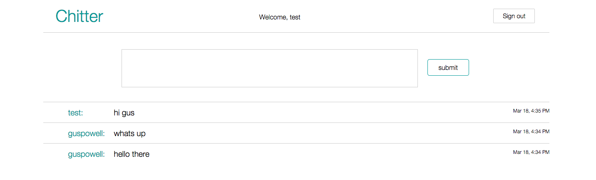

# Chitter

## Introduction

This week's weekend challenge was to create a basic Twitter app using the technologies we'd learnt during the week. Required features include the ability to register, login and post a tweet.



## Technologies Used

- Ruby
- Sinatra
- DataMapper
- PostgreSQL
- CSS
- BCrypt
- RSpec

## Enhancements

- [ ] Make it such that you have to be logged in to see the posts
- [ ] Add #hashtags
- [ ] format the posting box to multiple lines

## How to run tests

Cone the repository and change into the direcotry:<br>
```
$ git clone git@github.com:guspowell/Chitter.git
$ cd Chitter
```
Install all the dependencies:<br>
```
$ bundle install
```
Create a local database:
```
$ psql
=# CREATE DATABASE chitter_test;
=# \q
```
Run auto_upgrade:
```
$ rake auto_upgrade
```
Create an environment variable pointing to your local database:
```
$ export DATABASE_URL=postgres://localhost/chitter_test
```
Run RSpec:
```
rspec
```
## Favourite Code Snippet
~~~ruby
def self.authenticate(username, password)
  user= first(:username => username)
  if user && BCrypt::Password.new(user.password_digest) == password
    user
  else
    nil
  end
end
~~~
